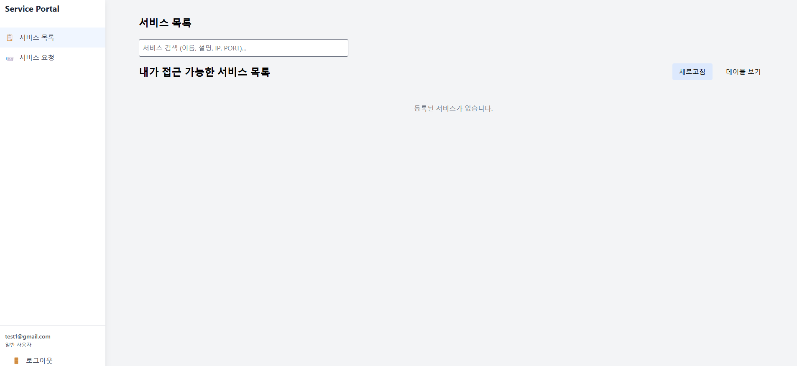
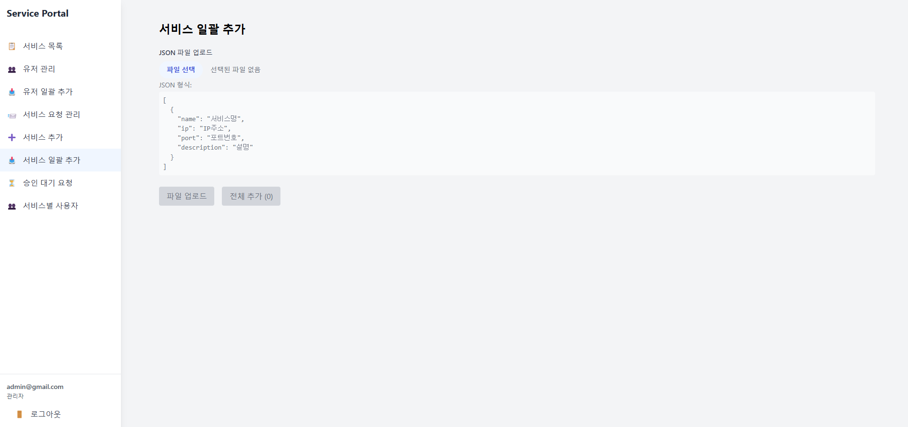

# Service Portal

## 프로젝트 개요
Service Portal은 운영자가 특정 API 서비스를 등록하고, 사용자가 로그인 후 UI에서 해당 API를 선택하여 접근할 수 있도록 하는 시스템입니다. JWT 기반 인증을 통해 보안을 강화하였습니다.

### 주요 기능
- **사용자 회원가입 및 로그인**
  - 이메일 도메인은 `@gmail.com`만 가능.
  - JWT 기반 인증을 사용하여 보안 강화.

- **운영자(Admin) 기능**
  - 특정 IP:PORT 정보를 입력하여 API 서비스 등록 및 관리.
  - 등록된 API 서비스는 사용자에게 목록으로 제공됨.

- **사용자 기능**
  - 로그인 후 div 형태의 UI에서 API를 선택.
  - 선택한 API에 대해 JWT 인증 후 접근 가능.

## 화면

### 사용자 화면 



### 관리자 화면 



## 기술 스택
| 영역       | 기술                     |
|------------|--------------------------|
| Frontend   | React (Next.js 가능)     |
| Backend    | FastAPI                  |
| DB         | PostgreSQL / SQLite      |
| Auth       | JWT (PyJWT)             |
| Proxy      | Nginx                   |
| Container  | Docker + Docker Compose   |

## 시작하기

### 1. 환경 설정
```bash
# 필요한 디렉토리 생성
mkdir -p nginx/services.d nginx/logs nginx/conf.d

# nginx 설정 파일 권한 설정
chmod 777 nginx/services.d
chmod 777 nginx/logs

# 환경변수 설정 (.env 파일 생성)
echo "ALLOWED_DOMAIN=gmail.com" > .env
```

### 2. 서비스 실행
```bash
# 네트워크 생성
docker network create app-network

# 서비스 빌드 및 시작
docker-compose up --build -d

# 로그 확인
docker-compose logs -f

# 특정 서비스 로그 확인
docker-compose logs -f backend
docker-compose logs -f nginx
```

### 3. 서비스 관리
```bash
# 서비스 중지
docker-compose down

# 볼륨 포함하여 완전 제거
docker-compose down -v

# 특정 서비스만 재시작
docker-compose restart backend
docker-compose restart nginx
```

### 4. 로그 확인
- Backend 로그: `docker-compose logs backend`
- Nginx 로그: `nginx/logs/` 디렉토리
- DB 로그: `docker-compose logs db`

### 5. 접속 정보
- Backend API: http://localhost:8000
- Frontend: http://localhost:1234
- API 문서: http://localhost:8000/docs

### 6. 초기 계정
- 관리자: admin@${ALLOWED_DOMAIN} / admin$01

### 7. 문제 해결
```bash
# 1. 모든 컨테이너 중지 및 제거
docker-compose down
docker ps -a | grep serviceportal  # 남은 컨테이너 확인
docker rm -f $(docker ps -a | grep serviceportal | awk '{print $1}')  # 강제 제거

# 2. 네트워크 제거
docker network ls  # 네트워크 목록 확인
docker network rm serviceportal_app-network

# 3. 서비스 재시작
docker-compose up -d
```

### 8. 개발 시 참고사항
- Backend 코드 수정 시 자동 리로드됨
- Nginx 설정 수정 시 `docker-compose restart nginx` 필요
- DB 스키마 변경 시 `docker-compose down -v` 후 재시작 필요

## Docker Compose 환경 (개발용)

## Docker Swarm 환경 (운영용)

### 1. Swarm 초기화 및 설정
```bash
# Swarm 모드 초기화 (매니저 노드)
docker swarm init

# Overlay 네트워크 생성
docker network create --driver overlay --attachable serviceportal_app-network

# 다른 노드를 워커로 추가 (출력된 명령어를 워커 노드에서 실행)
docker swarm join --token <token> <manager-ip>:2377

# 노드 상태 확인
docker node ls
```

### 2. 스택 배포
```bash
# 스택 배포
docker stack deploy -c docker-compose.yml serviceportal

# 배포 상태 확인
docker stack ps serviceportal
docker service ls

# 특정 서비스 로그 확인
docker service logs serviceportal_backend
docker service logs serviceportal_nginx
```

### 3. 스케일링
```bash
# 서비스 복제본 수 조정
docker service scale serviceportal_backend=5
docker service scale serviceportal_nginx=3

# 현재 복제본 상태 확인
docker service ls
```

### 4. 업데이트 관리
```bash
# 서비스 롤링 업데이트
docker service update --image newimage:tag serviceportal_backend

# 업데이트 롤백
docker service rollback serviceportal_backend
```

### 5. 스택 관리
```bash
# 전체 스택 목록 확인
docker stack ls

# 스택의 서비스 목록
docker stack services serviceportal

# 스택 제거
docker stack rm serviceportal
```

### 6. 문제 해결
```bash
# 서비스 상태 상세 확인
docker service ps --no-trunc serviceportal_backend

# 노드 상태 확인
docker node inspect <node-id>

# 서비스 로그 실시간 확인
docker service logs -f serviceportal_backend
```

### 7. 운영 시 참고사항
- 매니저 노드는 최소 3개 이상 권장 (고가용성)
- 데이터베이스는 단일 복제본으로 유지
- 설정 변경 시 서비스 업데이트 필요: `docker service update --force serviceportal_nginx`
- 볼륨 데이터는 노드 간 공유되지 않으므로 외부 스토리지 사용 권장
- 로드밸런싱은 Swarm의 내장 기능 활용

### 8. 보안 설정
```bash
# 시크릿 생성
echo "your-secret-key" | docker secret create jwt_secret -

# 시크릿 사용
docker service update --secret-add jwt_secret serviceportal_backend

# 네트워크 암호화 활성화
docker network create --driver overlay --opt encrypted serviceportal_network
```

### 환경변수 설정
| 변수명 | 설명 | 기본값 |
|--------|------|---------|
| ALLOWED_DOMAIN | 회원가입 허용 도메인 | gmail.com |